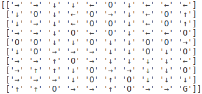
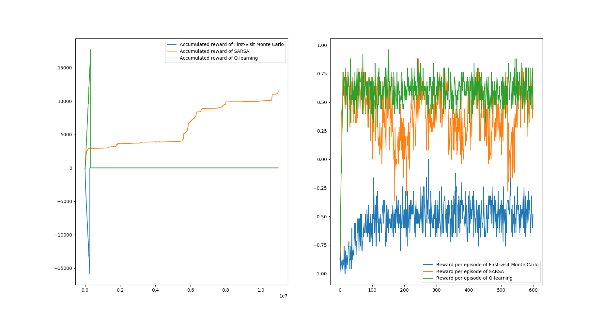

# Project I for ME5406 Deep Learning for Robotics: Frozen Lake Problem and Its Variation
This is a project for NUS ME5406. A frozen lake problem is considered to implement three reinforcement learning algorithms, first-visit Monte Carlo Control without exploring starts, SARSA and Q-learning, both with an $\epsilon$-greedy behavior policy, all from the ground up. Parameters could be tuned in the code, while the **method** augument could be specified with command in the terminal.

## Dependencies
* matplotlib
* numpy
* pandas (for batch test)

## Usage
1. Clone the repository
   ```bash
   git clone https://github.com/J1dan/RL.git
   ```

2. Install the required libraries using pip

3. Run the python file in the folders with argument --method. *Options: 'None', 'randomArgmax', 'q_reset', 'combined'

   ```bash
   python main_task1.py --method='q_reset' 
   ```
   or *Options: 'None', 'randomArgmax', 'q_reset', 'combined', 'dangerAvoidance', 'exploringStart'
   ```bash
   python main_task2.py --method='exploringStart' 
   ```

3. For batch test, also run with augument --method. *Options: 'None', 'randomArgmax', 'q_reset', 'combined'

   ```bash
   python batch_test_task1.py --method='q_reset' 
   ```
   or *Options: 'None', 'randomArgmax', 'q_reset', 'combined', 'dangerAvoidance', 'exploringStart'
   ```bash
   python batch_test_task2.py --method='exploringStart' 
   ```

## Demonstration

### Learned policy


Q-learning with method 'exploringStart'


### Learning curve


Cumulative and average reward of three algorithms with method 'exploringStart'